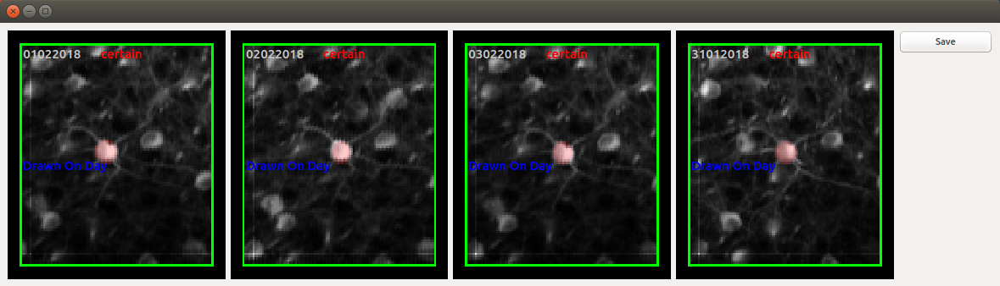

# Matching ROIs across days

If the same group of cells is repeatedly imaged across days, many experiments require matching cells across days. To enable this, 

## Algorithmic Approach

## GUI for curation

