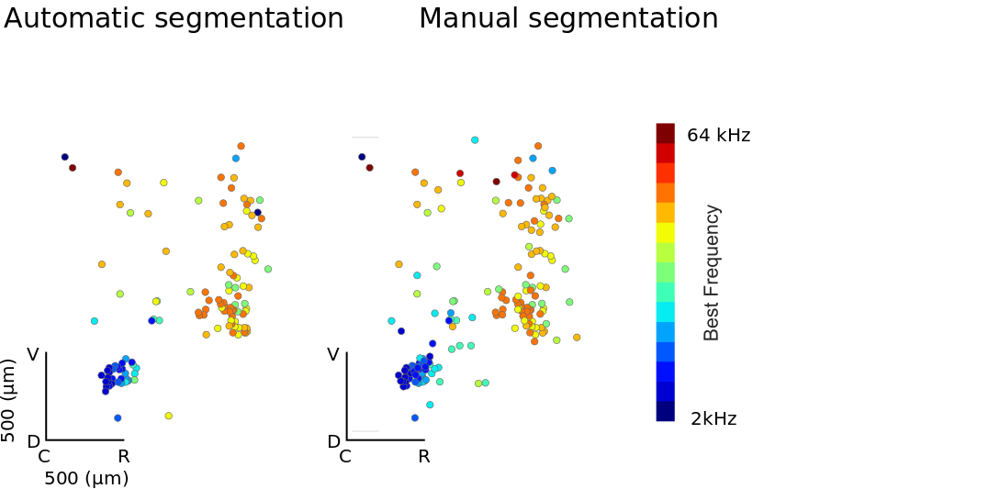

# ROI Definition Methods

There are two approaches to ROI definition that can be used in the context of this toolbox and they are by and large complementary. The first is an [automatic algorithm](rois.md#auto); the second is a [Manual Curation GUI](rois.md#manual)

<h2 id="auto">Automatic Approach</h2>

The automatic approach to ROI definition is a two-step process. In the first step, putative centroids of ROIs are identified. This is done by moving a sliding window 

### Training an ROI classifer

### Using a pre-trained ROI classifier

We have developed a simple algorithm for automatic roi definition. To run this algorithm, run:

    run_roi_finder.py -sess -1 -ded 3 2 2 -thresh 0.96 roi_finder_name /path/to/hdf5.h5 

where roi_finder name is an automatic roi finder derived from training.

#### Physiological Validation

A potential concern is that our automatic method relies soley on the mean image for identification. This may bias cell selection towards those that are uninteresting. We therefore validated the approach by comparing topographic organisation estimated using ROIs selected manually based on both mean image and full image stack (acquired by [Manual Curation GUI](rois.md#manual)) and those based purely on automatic ROI drawing. Included in the images are those ROIs which, after a simple ANOVA, are deemed significantly frequency tuned (p<0.01). 

Data and and analysis generously run by  <a href= https://www.dpag.ox.ac.uk/team/samuel-picard> Samuel Picard </a>

<h2 id="manual">Manual Curation</h2>

    ROI_Drawer.py /path/to/hdf5.h5

### Image of the GUI used for ROI and data curation

